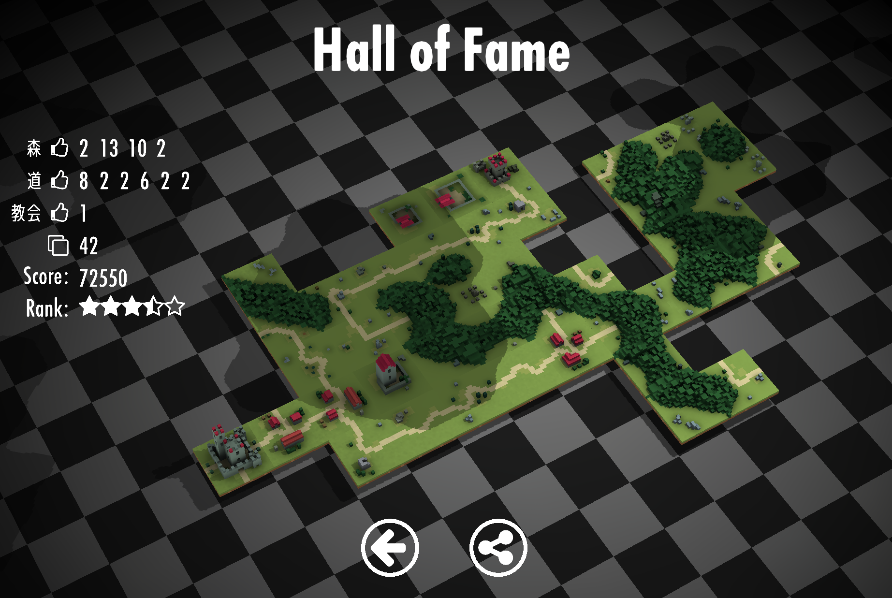

# iOS App Puzzle and Monarch

## About
「君主候補となって国作り。ただし制限時間は90秒」

次々と出現するパネルを上手に置いて、得点を競いましょう!!
道を繋いで、森を広げて、教会を建てて...目指せ世界一!!

"You make a country as a prince candidate, the time limit is 90 seconds."

Let's make your own country by combining panels that appear one after another!!
City, church, vast forest ... What country would you like to make?

[⇒AppStore](https://itunes.apple.com/WebObjects/MZStore.woa/wa/viewSoftware?id=1397142472&mt=8)

## Getting Started

+ VisualStudio2017
+ Xcode10.1

1. Cinder 0.9.1を用意
1. boost 1.67.0 と glm 0.9.8.5をCinderのフォルダ内にコピー
1. Cinder 0.9.1のライブラリと同じ場所にプロジェクトののフォルダを配置します。
1. Let's build!!

## Dependencies

+ [Cinder 0.9.1](https://github.com/cinder/Cinder)
+ [boost 1.67.0](https://www.boost.org) 
+ [glm 0.9.8.5](https://github.com/g-truc/glm)
+ [stb_truetype.h 1.17](https://github.com/nothings/stb)
+ [fontstash](https://github.com/memononen/fontstash)

## Thanks to

+ [Font Awesome 4.7.0](https://fontawesome.com)
+ [MagicaVoxel](https://ephtracy.github.io)

## License
License All source code files are licensed under the MPLv2.0 license

[MPLv2.0](https://www.mozilla.org/MPL/2.0/)

なおこのリポジトリの内容物の一部を改造した物を商用作品として無許諾で公開する事を禁じます

In addition, it is prohibited to publish contents that have modified part of the contents of this repository as commercial works without permission.